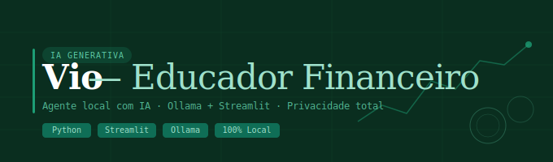

<div align="center">



<br/>

# 💰 Vio — Educador Financeiro com IA

**Agente conversacional local que educa, orienta e personaliza decisões financeiras — sem enviar nenhum dado para a nuvem.**

<br/>


</div>

---

## 🧠 Sobre o Projeto

O **Vio** é um educador financeiro virtual construído com IA Generativa, desenvolvido como entrega do desafio **BIA do Futuro** da [DIO](https://www.dio.me/).

Diferente de um chatbot comum, o Vio conhece o perfil do cliente — seu histórico de transações, atendimentos anteriores e objetivos financeiros — e usa esses dados como contexto para oferecer uma conversa personalizada, didática e segura. Todo o processamento acontece localmente via **Ollama**, garantindo privacidade total dos dados.

---

## ✨ Funcionalidades

| | Recurso | Descrição |
|---|---|---|
| 💬 | Conversa natural | Dialoga sobre finanças pessoais com linguagem acessível |
| 🎯 | Personalização real | Usa perfil, transações e histórico do cliente como contexto |
| 🔒 | 100% local | Roda via Ollama — nenhum dado sai da sua máquina |
| 🛡️ | Anti-alucinação | System prompt com regras claras de comportamento e limites |
| 📚 | Tom educativo | Explica conceitos sem recomendar investimentos específicos |

---

## 🗂️ Estrutura do Repositório

```
📁 dio-lab-bia-do-futuro/
│
├── 📁 data/                          # Base de conhecimento (dados mockados)
│   ├── transacoes.csv                # Histórico de transações do cliente
│   ├── historico_atendimento.csv     # Histórico de atendimentos anteriores
│   ├── perfil_investidor.json        # Perfil e preferências do cliente
│   └── produtos_financeiros.json     # Produtos e serviços disponíveis
│
├── 📁 docs/                          # Documentação completa do agente
│   ├── 01-documentacao-agente.md     # Caso de uso, persona e arquitetura
│   ├── 02-base-conhecimento.md       # Estratégia de dados
│   ├── 03-prompts.md                 # Engenharia de prompts
│   ├── 04-metricas.md                # Avaliação e métricas de qualidade
│   └── 05-pitch.md                   # Roteiro do pitch
│
├── 📁 src/
│   └── app.py                        # Aplicação Streamlit
│
├── 📁 assets/                        # Imagens e diagramas
├── 📁 examples/                      # Exemplos de interação
└── 📄 README.md
```

---

## 🚀 Como Executar

**Pré-requisitos:** Python 3.9+ e [Ollama](https://ollama.com/) instalado.

```bash
# 1. Clone o repositório
git clone https://github.com/torreskleber/dio-lab-bia-do-futuro.git
cd dio-lab-bia-do-futuro

# 2. Instale as dependências
pip install streamlit pandas requests

# 3. Baixe o modelo
ollama pull gpt-oss

# 4. Inicie a aplicação
streamlit run src/app.py
```

> ⚠️ O Ollama precisa estar rodando em `http://localhost:11434` antes de iniciar o app.

---

## 🛠️ Stack

| Camada | Tecnologia |
|---|---|
| Interface | [Streamlit](https://streamlit.io/) |
| LLM Local | [Ollama](https://ollama.com/) — modelo `gpt-oss` |
| Linguagem | Python 3.9+ |
| Dados | CSV + JSON (mockados) |

---

## 📄 Documentação

Toda a especificação do agente está em [`docs/`](./docs):

- [`01-documentacao-agente.md`](./docs/01-documentacao-agente.md) — Caso de uso, persona e arquitetura
- [`02-base-conhecimento.md`](./docs/02-base-conhecimento.md) — Estratégia de dados e fontes
- [`03-prompts.md`](./docs/03-prompts.md) — Engenharia de prompts e edge cases
- [`04-metricas.md`](./docs/04-metricas.md) — Avaliação e métricas de qualidade
- [`05-pitch.md`](./docs/05-pitch.md) — Roteiro do pitch de 3 minutos

---

## 👤 Autor

**Kleber Torres**  
Desenvolvedor em formação, com foco em IA, automação e soluções digitais.  
Portfólio: **`https://github.com/torreskleber`**

<a href="https://github.com/torreskleber">
  
</a>

Feito com 💚 por **Kleber Torres** como parte do desafio BIA do Futuro — [DIO](https://www.dio.me/).

---
## 📜 Licença

Este projeto foi desenvolvido para fins educacionais como parte de um desafio da [DIO](https://www.dio.me/).

